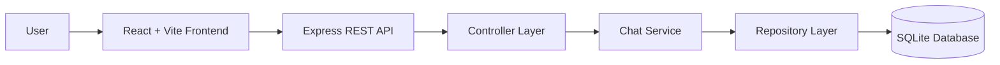

# Interview Preparation Chatbot

An AI-powered interview preparation chatbot designed to help students and job seekers practice technical, HR, aptitude, and behavioral interview questions through an interactive conversational interface. The chatbot provides concept explanations, interview practice sessions, and instant responses using a retrieval-based approach over a local SQLite database without relying on external AI APIs.

---

## 📌 Problem Statement

Preparing for technical interviews often requires switching between multiple resources such as interview websites, notes, videos, and books. This makes learning fragmented and inefficient.

The Interview Preparation Chatbot addresses this problem by providing a single conversational platform where users can learn concepts, practice interview questions, and receive structured responses in real time.

---

## ✨ Key Features

### 💬 Chatbot Mode
- Ask technical and HR interview questions
- Covers DSA, OOP, DBMS, Operating Systems, Computer Networks, Programming, and Behavioral topics
- Instant retrieval-based responses

### 📖 Learning Mode
- Structured concept explanations
- Key points and examples
- Related interview questions
- Beginner-friendly learning format

### 🎯 Practice Mode
- Interactive mock interview sessions
- Domain-specific practice
- Answer evaluation and feedback
- Session-based interview flow

### ⚡ Retrieval Engine
- SQLite-based knowledge retrieval
- Intent detection
- Keyword extraction
- Domain identification
- Weighted relevance scoring

---

## 🏗️ System Architecture



---

## 💻 Tech Stack

### Frontend
- React
- Vite
- JavaScript
- CSS

### Backend
- Node.js
- Express.js

### Database
- SQLite
- better-sqlite3

### Development Tools
- Nodemon

---

## 🚀 Key Functionalities

- Technical interview question answering
- HR interview preparation
- Behavioral interview practice
- Concept learning mode
- Interactive mock interviews
- SQLite-based retrieval engine
- Structured chatbot responses
- Lightweight session management

---

## 📂 Project Structure

```text
InterviewPrepChatbot/
├── client/
├── data/
├── src/
│   ├── config/
│   ├── controllers/
│   ├── data/
│   ├── models/
│   ├── repositories/
│   ├── routes/
│   ├── services/
│   ├── app.js
│   └── server.js
├── .env.example
├── package.json
├── README.md
└── interview_prep_chatbot.db
```

---

## ⚙️ Installation

### Clone the Repository

```bash
git clone https://github.com/your-username/InterviewPrepChatbot.git
```

### Navigate to the Project

```bash
cd InterviewPrepChatbot
```

### Install Backend Dependencies

```bash
npm install
```

### Install Frontend Dependencies

```bash
cd client
npm install
cd ..
```

### Configure Environment Variables

Create a `.env` file:

```env
PORT=5000
SQLITE_DB_PATH=data/interview_prep_chatbot.db
```

### Start Backend

```bash
npm run dev
```

### Start Frontend

```bash
npm run client:dev
```

Backend:

```text
http://localhost:5000
```

Frontend:

```text
http://localhost:5173
```

---

## 📡 API Endpoints

| Method | Endpoint | Description |
|---------|----------|-------------|
| GET | `/api/health` | Health Check |
| POST | `/chat` | Chat Endpoint |
| POST | `/api/chat` | Chat Endpoint |

---

## 💡 Sample Queries

### Technical

- What is polymorphism?
- Explain normalization in DBMS.
- Difference between process and thread.
- What is hashing?
- Explain merge sort.

### Learning Mode

- Explain dynamic programming.
- What is multithreading?
- Explain deadlock.

### Practice Mode

- Ask me questions on OOP.
- Practice DBMS.
- Ask me HR interview questions.
- Next question.
- Stop practice.

---

# 📸 Screenshots

### Home Page


---

### Chatbot Interface


---

### Learning Mode


---

### Practice Mode


---

### Technical Interview Session


---

### HR Interview Session


---

##  Future Enhancements

- AI-powered answer evaluation
- User authentication
- Progress tracking dashboard
- Bookmark important questions
- Export interview summaries
- Voice-based interview practice
- Additional interview datasets

---

##  Author

**Alfina Fhobi R**

B.Tech Computer Science and Engineering

Karunya Institute of Technology and Sciences

---

##  License

This project is developed for academic and educational purposes.
